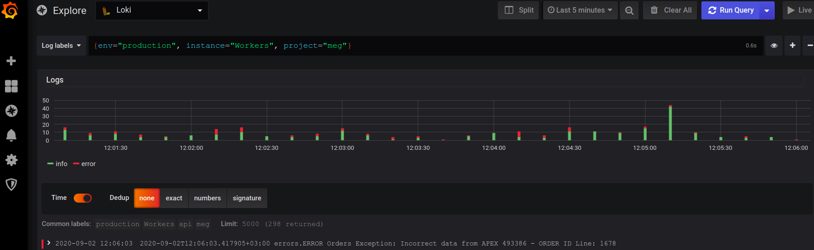

# Loki configurations
{: .no_toc}

## Table of contents
{: .no_toc .text-delta }

1. TOC
{:toc}

### Host for Loki
```terminal
http://metrics.memcrab.com:3100/api/prom/push
```

### Метод запроса
```terminal
POST
```

### Content-Type
```terminal
application/json
```

### Передаваемые параметры
1. `streams`  самый верхний элемент, в нем вложена необходимая структура данных для интерфейса Loki
  1. `labels`- в него передаются необходимые метки для отображения и фильрации внутри интерфейса Loki:
    1. `type` - тип передаваемых данных (INFO, ERROR)
    2. `source` - источник получения данных (megasport_development|megasport_production)
    3. `project` - проект (megasport|meg)
    4. `job` - процесс (api)
    5. `instance` - физический источник (контейнер докера, сервер)
    6. `env` - окружение (development, production,qa)
  2. `entries` - необходимые данные для интерфейса Loki
    1.  `ts` - время для фильтрации и отображения в интерфейсе Loki(стандарт RFC3339Nano), пример 2020-09-02T11:08:03.346240+03:00
    2. `line` - сообщение для отображения в интерфейсе Loki, то что нужно "залогировать"


Пример передаваемой структуры:

```terminal
{"streams":[{"labels":"{type="INFO", source="megasport_development", project="megasport", job="api", instance="3e9daf589a94", env="development"}","entries":[{"ts":"2020-09-02T11:08:03.346240+03:00","line":"2020-09-02T11:08:03.346240+03:00 log.LOG LOG FILE: asdasdsa\/send_GA\/\/error LOG CONTENT: {"key":"test"}"}]}]}
```
